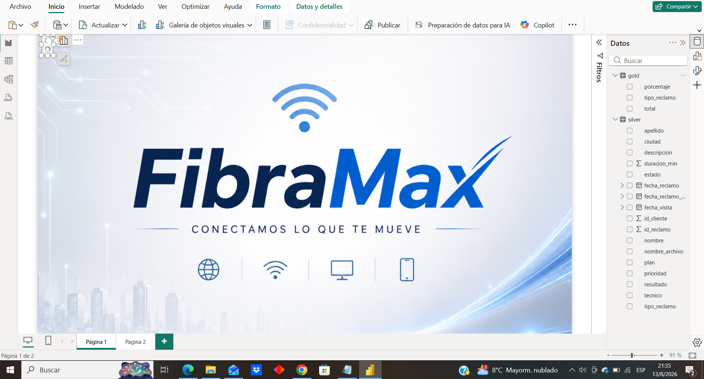
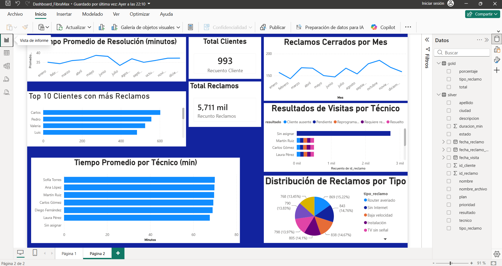

# DataEngineering

# 🚀 FibraMax - Data Engineering Project

Proyecto end-to-end de Ingeniería de Datos desarrollado sobre Microsoft Azure
para una empresa ficticia de telecomunicaciones.

## 🏗️ Arquitectura

Azure Data Factory
        ↓
Azure Data Lake Storage Gen2
        ↓
Bronze
        ↓
Azure Databricks / PySpark
        ↓
Silver
        ↓
Gold
        ↓
Power BI

## 🛠️ Tecnologías

- Azure Data Factory
- Azure Data Lake Storage Gen2
- Azure SQL Database
- Azure Databricks
- PySpark
- SQL
- Power BI

## 📊 Capas de datos

### Bronze
Datos ingeridos desde las fuentes originales.

### Silver
Datos procesados, limpiados y transformados.

### Gold
Datos preparados para análisis y visualización.

## 📈 Visualización

Los datos finales son utilizados en Power BI para generar
indicadores y reportes de negocio.

## 🎯 Objetivo

Construir un pipeline de datos completo utilizando servicios
cloud de Azure y aplicando una arquitectura moderna de procesamiento
y almacenamiento de datos.

# 📊 Proyecto Data Engineering: Dashboard FibraMax

## 📌 Descripción General
Este proyecto consiste en la extracción, transformación y visualización de datos para la empresa de telecomunicaciones FibraMax.
Se utilizó Azure Blob Storage para la extracción de archivos JSON, Power Query para el proceso de ETL (limpieza de nulos,
transformación de fechas y combinación de archivos) y Power BI para la construcción de un dashboard interactivo de gestión de reclamos.

## ⚙️ Tecnologías Utilizadas
- **Extracción:** Azure Blob Storage
- **Procesamiento/ETL:** Power Query (Limpieza de datos, reemplazo de nulos, filtrado)
- **Visualización:** Power BI Desktop (Gráficos de líneas, barras, sectores y tarjetas KPI)
- **Control de versiones:** GitHub

## 📈 KPIs y Métricas Incluidas
- **Total de Reclamos:** 5.711 registros
- **Clientes Únicos:** 993 clientes
- **Tiempo Promedio de Resolución:** Medido en minutos por técnico y su evolución mensual.
- **Top 10 Clientes:** Identificación de los clientes con más incidencias.
- **Distribución por Tipo:** Análisis de los reclamos más frecuentes (Router averiado, Sin Internet, etc.).
- **Resultados de Visitas:** Efectividad de los técnicos en campo (Resuelto, Pendiente, Cliente ausente).

## 🖼️ Vista Previa del Dashboard

## 🚀 Cómo ver el informe
1. Descargar el archivo `Dashboard_FibraMax.pbix` desde este repositorio.
2. Abrirlo con **Power BI Desktop** (Es necesario tener el programa instalado).
3. *(Opcional)* Si el reclutador no tiene Power BI, el dashboard también está publicado en Power BI Service (si aplicaste a la versión Pro/Fabric).
